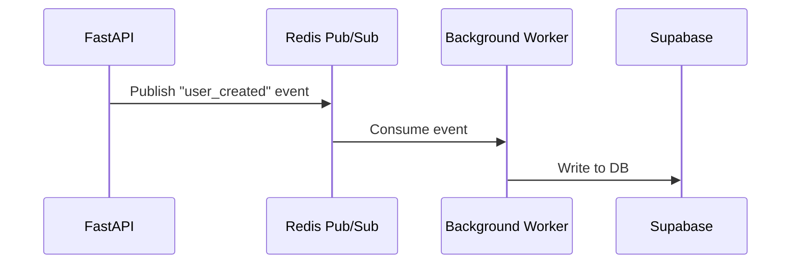

# ADR-003: Choice of Redis for Event Queue

## Context
We need a fast, reliable event queue for async communication between services.

## Decision
We choose Redis Pub/Sub for its speed, simplicity, and existing use in our stack.

## Alternatives
- RabbitMQ: More features, but more complex to operate.
- Kafka: Overkill for our current scale.

## Consequences
- Easy integration with FastAPI and Python.
- Limited durability (no message persistence).
- May need to revisit if scale increases.

---

# Voorbeeld: Non-Functional Requirements (NFR) Advies

- **Performance:** API response < 200ms, batch jobs < 5 min
- **Scalability:** Horizontale scaling via Kubernetes, stateless services
- **Security:** JWT auth, HTTPS only, OWASP top 10 mitigaties
- **Monitoring:** Prometheus metrics, Sentry error tracking
- **Compliance:** GDPR, audit logging, data retention policy

---

# Voorbeeld: Risicoanalyse

- **Brute force attacks:** Mitigeren met rate limiting (FastAPI middleware)
- **Credential leaks:** Gebruik environment secrets, geen hardcoded keys
- **Session hijacking:** JWT expiry en secure cookies
- **Single point of failure:** Redis cluster met sentinel

---

# Review-checklist

- [x] API endpoints consistent en RESTful
- [x] Alle data flows async waar mogelijk
- [ ] Security headers en input validatie aanwezig
- [ ] Logging en monitoring voorzien
- [ ] Documentatie up-to-date

---

# OpenAPI/Swagger Snippet

```yaml
openapi: 3.0.0
info:
  title: User Service API
  version: 1.0.0
paths:
  /users/:
    get:
      summary: List all users
      responses:
        '200':
          description: OK
  /users/{id}:
    get:
      summary: Get user by ID
      parameters:
        - in: path
          name: id
          required: true
          schema:
            type: string
      responses:
        '200':
          description: OK
```

---

# Teststrategie

- **Unit tests:** Voor alle business logic (pytest, coverage > 90%)
- **Integration tests:** API endpoints, database interacties (pytest + testcontainers)
- **E2E tests:** Belangrijkste user flows (Playwright, Selenium)
- **Security tests:** OWASP ZAP scan in CI/CD
- **Load tests:** Locust, k6 voor performance baseline

---

# Event-driven Flow (Mermaid)



---

# Memory Design

- **Short-term:** Redis (TTL 1h, per user/session)
- **Long-term:** Supabase (Postgres, JSONB, vector search via pgvector)
- **AI context:** pgvector (semantic search, context retrieval for LLMs)

---

# Infra-as-Code Advies

- Gebruik Terraform voor cloud resources
- Docker Compose voor lokale development
- CI/CD pipelines met GitHub Actions
- Secrets management via Vault of environment variables

---

# Release/rollback strategieën

- Blue/green deployment
- Canary releases
- Rollback via tagged Docker images
- Feature toggles voor experimenten

---

# Architectuur Anti-patterns

- **God Object:** Te veel verantwoordelijkheid in één component.
- **Spaghetti Code:** Ongeorganiseerde, moeilijk te volgen afhankelijkheden.
- **Golden Hammer:** Eén technologie voor alles willen gebruiken.
- **Reinventing the Wheel:** Bestaande oplossingen negeren.
- **Lack of Documentation:** Geen of slechte documentatie bij architectuurkeuzes.
