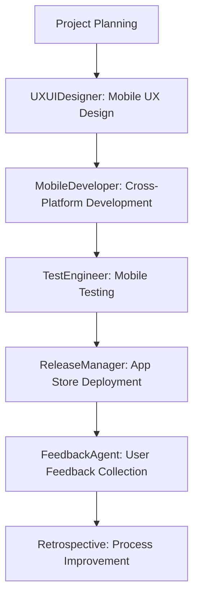
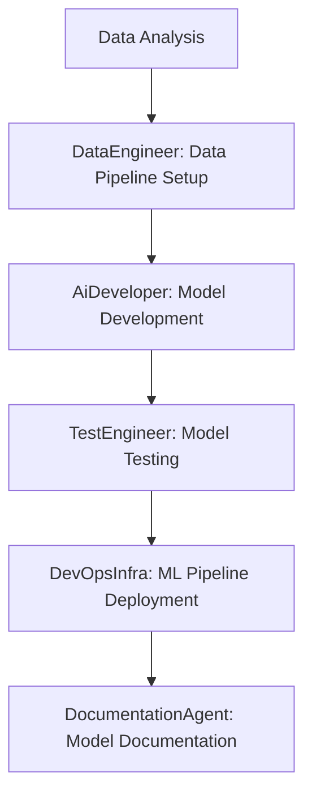
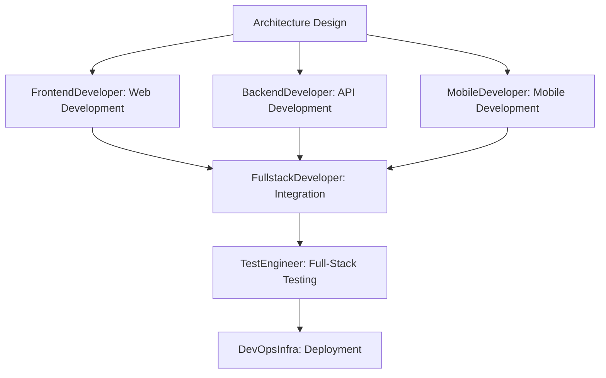

# BMAD Project Management

## 📋 Overzicht

De BMAD Project Manager is een centraal systeem voor het beheren van project configuraties, requirements, en context voor alle BMAD agents. Het systeem is geoptimaliseerd voor moderne development workflows inclusief mobile development, AI/ML development, en cross-platform development.

## 🏗️ Architectuur

### Project Manager vs Agents

| Component | Type | Locatie | Functie |
|-----------|------|---------|---------|
| **Project Manager** | Utility/Service | `/projects/` | Project configuratie & context |
| **Agents** | AI/LLM Workers | `/agents/` | Specifieke taken (Frontend, UX, Mobile, etc.) |

### Bestandsstructuur

```
bmad/projects/
├── project_manager.py  # Core project management class
├── cli.py             # Command-line interface
└── configs/           # Project configuratie files (.json)
    ├── project1.json
    ├── project2.json
    └── ...
```

## 🚀 Gebruik

### CLI Commando's

```bash
# Toon alle projecten
python3 bmad/projects/cli.py list

# Maak nieuw project
python3 bmad/projects/cli.py create my-project --type web_app

# Maak mobile project
python3 bmad/projects/cli.py create my-mobile-app --type mobile_app

# Laad project
python3 bmad/projects/cli.py load my-project

# Toon project info
python3 bmad/projects/cli.py info

# Voeg requirement toe
python3 bmad/projects/cli.py add-requirement "User authentication required"

# Voeg user story toe
python3 bmad/projects/cli.py add-story "As a user, I want to log in"

# Interactieve modus
python3 bmad/projects/cli.py interactive
```

### Programmatisch Gebruik

```python
from bmad.projects.project_manager import project_manager

# Maak nieuw project
config = project_manager.create_project("my-app", "web_app")

# Maak mobile project
config = project_manager.create_project("my-mobile-app", "mobile_app")

# Laad project
config = project_manager.load_project("my-app")

# Voeg requirement toe
project_manager.add_requirement("Responsive design", "non_functional")

# Haal project context op
context = project_manager.get_project_context()
```

## 📊 Project Types

### Web App
```json
{
  "project_type": "web_app",
  "tech_stack": {
    "frontend": ["React", "TypeScript", "Next.js", "Shadcn/ui"],
    "backend": ["Python", "FastAPI", "PostgreSQL"],
    "deployment": ["Docker", "AWS/GCP"]
  },
  "architecture": {
    "type": "microservices",
    "frontend": "SPA",
    "backend": "REST API"
  },
  "agents": {
    "primary": ["FrontendDeveloper", "BackendDeveloper", "FullstackDeveloper"],
    "support": ["UXUIDesigner", "TestEngineer", "DevOpsInfra"]
  }
}
```

### Mobile App
```json
{
  "project_type": "mobile_app",
  "tech_stack": {
    "frontend": ["React Native", "TypeScript", "Expo"],
    "backend": ["Python", "FastAPI", "PostgreSQL"],
    "deployment": ["Expo", "App Store", "Google Play"]
  },
  "architecture": {
    "type": "cross_platform",
    "frontend": "React Native/Flutter",
    "backend": "REST API"
  },
  "agents": {
    "primary": ["MobileDeveloper", "UXUIDesigner"],
    "support": ["BackendDeveloper", "TestEngineer", "ReleaseManager"]
  },
  "mobile_features": {
    "platforms": ["iOS", "Android"],
    "capabilities": ["Push Notifications", "Offline Support", "Biometric Auth"]
  }
}
```

### AI/ML Project
```json
{
  "project_type": "ai_ml_project",
  "tech_stack": {
    "ai_ml": ["Python", "TensorFlow", "PyTorch", "Prefect"],
    "backend": ["Python", "FastAPI", "PostgreSQL"],
    "deployment": ["Docker", "Kubernetes", "Cloud ML"]
  },
  "architecture": {
    "type": "ml_pipeline",
    "components": ["Data Pipeline", "Model Training", "Inference API"]
  },
  "agents": {
    "primary": ["AiDeveloper", "DataEngineer"],
    "support": ["BackendDeveloper", "DevOpsInfra", "TestEngineer"]
  }
}
```

### Full-Stack Application
```json
{
  "project_type": "fullstack_app",
  "tech_stack": {
    "frontend": ["React", "TypeScript", "Next.js", "Shadcn/ui"],
    "backend": ["Python", "FastAPI", "PostgreSQL"],
    "mobile": ["React Native", "Expo"],
    "deployment": ["Docker", "AWS/GCP", "App Store"]
  },
  "architecture": {
    "type": "fullstack",
    "components": ["Web App", "Mobile App", "API", "Database"]
  },
  "agents": {
    "primary": ["FullstackDeveloper", "MobileDeveloper", "UXUIDesigner"],
    "support": ["AiDeveloper", "DevOpsInfra", "ReleaseManager"]
  }
}
```

## 🤖 Agent Integration

### Optimized Agent Roster

**Core Development Agents:**
- **FrontendDeveloper**: React/Next.js development met Shadcn/ui integratie
- **BackendDeveloper**: API development en database design
- **FullstackDeveloper**: Full-stack development met Shadcn/ui integratie
- **TestEngineer**: Testing strategies en quality assurance

**Specialized Development Agents:**
- **MobileDeveloper**: Cross-platform mobile development (React Native, Flutter, native iOS/Android)
- **AiDeveloper**: AI/ML development met Prefect workflows
- **UXUIDesigner**: UX/UI design met mobile UX capabilities
- **SecurityDeveloper**: Security implementation en compliance
- **DataEngineer**: Data pipeline development en management
- **DevOpsInfra**: CI/CD pipeline en infrastructure management

**Management & Support Agents:**
- **ProductOwner**: Project management en requirement gathering
- **Architect**: System architecture en technical design
- **Scrummaster**: Agile process management
- **ReleaseManager**: Release planning en deployment coordination
- **Retrospective**: Process improvement en feedback analysis
- **FeedbackAgent**: Feedback collection en sentiment analysis
- **RnD**: Research en development
- **DocumentationAgent**: Technical documentation en Figma integration

**Advanced Orchestration:**
- **Orchestrator**: Workflow management met HITL capabilities
- **AccessibilityAgent**: Accessibility compliance met Shadcn integratie

### Agent Collaboration Workflows

#### Mobile Development Workflow


#### AI/ML Development Workflow


#### Full-Stack Development Workflow


## 🔧 Advanced Features

### Performance Monitoring
- **Real-time Metrics**: Live performance tracking voor alle agents
- **Historical Analysis**: Performance trend analysis en optimization
- **Resource Optimization**: Intelligent resource allocation en load balancing
- **Quality Assurance**: Continuous quality monitoring en improvement

### Inter-Agent Communication
- **Event-Driven Architecture**: Asynchronous event publishing en subscription
- **Context Sharing**: Seamless context sharing en synchronization
- **Workflow Orchestration**: Intelligent workflow orchestration en task assignment
- **Resource Coordination**: Coordinated resource management en allocation

### Human-in-the-Loop (HITL)
- **Approval Gates**: Automated approval workflows met human oversight
- **Decision Points**: Critical decision points requiring human input
- **Escalation Handling**: Automatic escalation naar appropriate stakeholders
- **Audit Trails**: Complete audit trails voor alle HITL decisions

### Cross-Platform Development
- **Mobile Development**: React Native, Flutter, native iOS/Android development
- **Web Development**: Next.js, React, Shadcn/ui development
- **AI/ML Integration**: Comprehensive AI en machine learning development
- **DevOps Automation**: Complete CI/CD pipeline automation en infrastructure management

## 📈 Project Lifecycle

### 1. Project Initialization
```bash
# Maak nieuw project
python3 bmad/projects/cli.py create my-project --type web_app

# Configureer project settings
python3 bmad/projects/cli.py configure --tech-stack react,typescript,nextjs

# Voeg requirements toe
python3 bmad/projects/cli.py add-requirement "User authentication"
python3 bmad/projects/cli.py add-requirement "Responsive design"
```

### 2. Development Phase
```bash
# Laad project context
python3 bmad/projects/cli.py load my-project

# Start development workflow
python3 bmad/projects/cli.py start-development

# Monitor progress
python3 bmad/projects/cli.py status
```

### 3. Testing & Quality Assurance
```bash
# Run tests
python3 bmad/projects/cli.py test

# Quality check
python3 bmad/projects/cli.py quality-check

# Performance test
python3 bmad/projects/cli.py performance-test
```

### 4. Deployment
```bash
# Prepare deployment
python3 bmad/projects/cli.py prepare-deployment

# Deploy
python3 bmad/projects/cli.py deploy

# Monitor deployment
python3 bmad/projects/cli.py monitor-deployment
```

## 🎯 Best Practices

### Project Configuration
1. **Define Clear Requirements**: Specificeer requirements duidelijk en meetbaar
2. **Choose Appropriate Tech Stack**: Selecteer tech stack gebaseerd op project requirements
3. **Plan Architecture**: Design architecture voor scalability en maintainability
4. **Assign Appropriate Agents**: Wijs agents toe gebaseerd op project type en requirements

### Development Workflow
1. **Follow Agile Principles**: Implementeer agile development practices
2. **Continuous Integration**: Gebruik CI/CD pipelines voor automated testing en deployment
3. **Code Quality**: Maintain high code quality met automated testing en code review
4. **Documentation**: Keep documentation up-to-date en comprehensive

### Mobile Development
1. **Cross-Platform Strategy**: Plan cross-platform development strategy
2. **Performance Optimization**: Focus op mobile performance en battery optimization
3. **User Experience**: Design voor mobile-first user experience
4. **App Store Compliance**: Ensure app store compliance en guidelines

### AI/ML Development
1. **Data Quality**: Ensure high data quality en proper data pipeline
2. **Model Validation**: Implement comprehensive model validation en testing
3. **Ethics & Bias**: Consider AI ethics en bias detection
4. **Explainability**: Implement model explainability en interpretability

## 🔮 Future Enhancements

### Planned Features
- **Advanced Analytics**: Comprehensive project analytics en reporting
- **AI-Powered Insights**: AI-powered project insights en recommendations
- **Enhanced Collaboration**: Advanced collaboration features en tools
- **Integration APIs**: APIs voor third-party tool integration
- **Cloud Integration**: Enhanced cloud platform integration

### Community Contributions
- **Custom Project Types**: Community-contributed project types en templates
- **Agent Extensions**: Community-developed agent extensions en plugins
- **Workflow Templates**: Community-contributed workflow templates
- **Best Practices**: Community-shared best practices en guidelines 