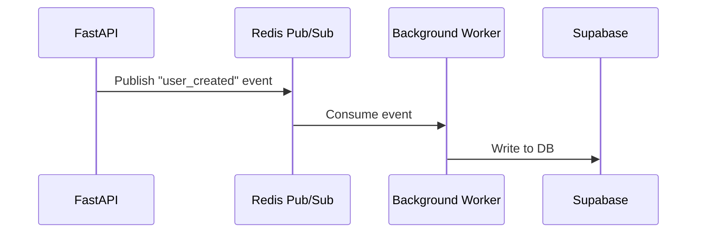

```mermaid
sequenceDiagram
    participant API as FastAPI
    participant Queue as Redis Pub/Sub
    participant Worker as Background Worker
    API->>Queue: Publish "user_created" event
    Queue->>Worker: Consume event
    Worker->>Supabase: Write to DB
```