# BMad Method: Core Architecture

## 1. Overview

**What’s new: Enhanced MCP Phase 2 integration complete – 23/23 agents!**

BMAD ondersteunt nu volledige **Enhanced MCP Phase 2** functionaliteit. Dit betekent dat alle 23 agents zijn uitgebreid met geavanceerde Multi-Agent Communication Protocol (MCP) features, observability en performance monitoring.

### MCP Enhanced Features (Phase 2)
- **Volledige Enhanced MCP integratie** voor alle agents (23/23)
- **Advanced Tracing**: OpenTelemetry-gebaseerde distributed tracing voor alle agent-operaties
- **Inter-agent Communication**: Geavanceerde communicatie en samenwerking tussen agents via MCP
- **Performance Optimization**: Real-time performance monitoring, metrics en optimalisatie
- **Security Validation**: Uitgebreide security checks en policy enforcement
- **Uitgebreide CLI**: Nieuwe en verbeterde CLI commands voor alle agents (inclusief tracing, security, performance, collaboration)
- **Volledige test coverage**: 1000+ tests, 100% passing
- **Gedocumenteerde YAML en README’s** voor alle agents

**Let op:** Deze functies zijn alleen beschikbaar in de Enhanced MCP Phase 2 implementatie (2025).

---

The BMad Method is designed to provide agentic modes, tasks and templates to allow repeatable helpful workflows be it for agile agentic development, or expansion into vastly different domains. The core purpose of the project is to provide a structured yet flexible set of prompts, templates, and workflows that users can employ to guide AI agents (like Gemini, Claude, or ChatGPT) to perform complex tasks, guided discussions, or other meaningful domain specific flows in a predictable, high-quality manner.

The systems core module facilitates a full development lifecycle tailored to the challenges of current modern AI Agentic tooling:

1. **Ideation & Planning**: Brainstorming, market research, and creating project briefs.
2. **Architecture & Design**: Defining system architecture and UI/UX specifications.
3. **Development Execution**: A cyclical workflow where a Scrum Master (SM) agent drafts stories with extremely specific context and a Developer (Dev) agent implements them one at a time. This process works for both new (Greenfield) and existing (Brownfield) projects.
4. **Advanced Orchestration**: Intelligent workflow management with Human-in-the-Loop (HITL) capabilities, performance monitoring, and cross-platform development support.

## 2. System Architecture Diagram

The entire BMad-Method ecosystem is designed around the installed `bmad-core` directory, which acts as the brain of the operation. The `tools` directory provides the means to process and package this brain for different environments.

## 3. Core Components

The `bmad-core` directory contains all the definitions and resources that give the agents their capabilities.

### 3.1. Agents (`bmad-core/agents/`)

- **Purpose**: These are the foundational building blocks of the system. Each agent is implemented as a class-based Python module with comprehensive CLI interface, resource management, and inter-agent collaboration capabilities.
- **Structure**: Each agent contains:
  - **Class-based Architecture**: Modern Python class structure with initialization, resource management, and history tracking
  - **Comprehensive CLI**: Full command-line interface with help system and argument parsing
  - **Resource Management**: Structured template and data file management with automatic creation and validation
  - **Performance Monitoring**: Integration with advanced performance monitoring and metrics collection
  - **Event Handling**: Message bus integration for inter-agent communication
  - **Export Capabilities**: Multi-format report export (Markdown, CSV, JSON)
  - **History Tracking**: Persistent history management for all agent activities
  - **Collaboration Features**: Inter-agent collaboration examples and workflows

#### 3.1.1. Optimized Agent Roster

**Core Development Agents:**
- **ProductOwner**: Project management, requirement gathering, backlog management
- **Architect**: System architecture, technical design, API specifications
- **FrontendDeveloper**: Frontend development with Shadcn/ui integration, React/Next.js expertise
- **BackendDeveloper**: Backend development, API implementation, database design
- **FullstackDeveloper**: Full-stack development with Shadcn/ui integration
- **TestEngineer**: Testing strategies, test automation, quality assurance
- **DevOpsInfra**: CI/CD pipelines, infrastructure management, deployment automation

**Specialized Agents:**
- **AiDeveloper**: AI/ML development, model training, AI integration
- **UXUIDesigner**: User experience design, UI components, design systems with mobile UX capabilities
- **SecurityDeveloper**: Security implementation, vulnerability assessment, compliance
- **AccessibilityAgent**: Accessibility compliance, WCAG guidelines, inclusive design with Shadcn integration
- **DataEngineer**: Data pipelines, ETL processes, data quality management
- **ReleaseManager**: Release planning, deployment coordination, version management
- **Retrospective**: Process improvement, feedback analysis, team optimization
- **FeedbackAgent**: User feedback collection, sentiment analysis, insights generation
- **RnD**: Research and development, innovation, prototype development
- **DocumentationAgent**: Technical documentation, API docs, user guides, Figma documentation

**Advanced Orchestration:**
- **Orchestrator**: Workflow management, event routing, HITL processes, intelligent task assignment
- **MobileDeveloper**: Cross-platform mobile development, React Native, Flutter, native iOS/Android

**Management Agents:**
- **Scrummaster**: Agile process management, sprint planning, team coordination
- **StrategiePartner**: Strategic planning, business analysis, market research

### 3.2. Advanced Services Integration

#### 3.2.1. Performance Monitoring
- **Agent Performance Monitor**: Real-time performance tracking with metrics collection
- **Metric Types**: SUCCESS_RATE, RESPONSE_TIME, ERROR_RATE, THROUGHPUT
- **Performance Profiles**: Agent-specific performance baselines and optimization targets
- **Historical Analysis**: Performance trend analysis and optimization recommendations

#### 3.2.2. Policy Engine
- **Advanced Policy Engine**: Rule-based decision making and access control
- **Policy Types**: Resource management, security policies, access control
- **Dynamic Policy Updates**: Runtime policy modification and validation
- **Compliance Enforcement**: Automated compliance checking and reporting

#### 3.2.3. Message Bus
- **Event-Driven Architecture**: Asynchronous event publishing and subscription
- **Event Routing**: Intelligent event routing and filtering
- **Inter-Agent Communication**: Seamless agent-to-agent communication
- **Event History**: Persistent event logging and replay capabilities

#### 3.2.4. Test Sprites
- **Component Testing**: Automated component testing and validation
- **Sprite Library**: Reusable test components and utilities
- **Test Automation**: Automated test generation and execution
- **Quality Assurance**: Continuous quality monitoring and reporting

#### 3.2.5. Context Management
- **Supabase Integration**: Persistent context storage and retrieval
- **Context Types**: Agent status, workflow state, project context
- **Context Sharing**: Cross-agent context sharing and synchronization
- **Context Persistence**: Long-term context storage and recovery

### 3.3. Agent Teams (`bmad-core/agent-teams/`)

- **Purpose**: Team files define collections of agents and workflows that are bundled together for specific purposes, enabling comprehensive development scenarios.
- **Structure**: Team files can include:
  - **Full-Stack Development**: Complete development team with frontend, backend, and DevOps
  - **Mobile Development**: Specialized mobile development team with cross-platform capabilities
  - **AI/ML Development**: AI-focused team with data science and ML engineering
  - **Security-First Development**: Security-focused team with compliance and testing
  - **Documentation-Focused**: Documentation and technical writing team

### 3.4. Workflows (`bmad-core/workflows/`)

- **Purpose**: Workflows define prescribed sequences of steps and agent interactions for specific project types, including advanced orchestration with HITL capabilities.
- **Structure**: Modern workflows include:
  - **Traditional Development**: Standard software development workflows
  - **Mobile Development**: Cross-platform mobile app development workflows
  - **AI/ML Projects**: Machine learning and AI development workflows
  - **Security Audits**: Security-focused development and audit workflows
  - **Documentation Projects**: Comprehensive documentation workflows

#### 3.4.1. Advanced Workflow Features

**Human-in-the-Loop (HITL) Integration:**
- **Approval Gates**: Automated approval workflows with human oversight
- **Decision Points**: Critical decision points requiring human input
- **Escalation Handling**: Automatic escalation to appropriate stakeholders
- **Audit Trails**: Complete audit trails for all HITL decisions

**Mobile Development Workflows:**
- **Cross-Platform Development**: React Native and Flutter development workflows
- **Native Development**: iOS and Android native development workflows
- **App Store Deployment**: App store submission and deployment workflows
- **Performance Optimization**: Mobile-specific performance optimization workflows

**Intelligent Task Assignment:**
- **Agent Selection**: Intelligent agent selection based on task requirements
- **Load Balancing**: Workload distribution across available agents
- **Skill Matching**: Task-to-agent skill matching and optimization
- **Performance-Based Assignment**: Assignment based on historical performance

### 3.5. Reusable Resources (`templates`, `tasks`, `checklists`, `data`)

- **Purpose**: These folders house the modular components that are dynamically loaded by agents based on their dependencies.
  - **`templates/`**: Contains markdown templates for common documents like PRDs, architecture specifications, user stories, and mobile app specifications
  - **`tasks/`**: Defines the instructions for carrying out specific, repeatable actions like "shard-doc" or "create-next-story"
  - **`checklists/`**: Provides quality assurance checklists for agents like the Product Owner (`po`) or Architect
  - **`data/`**: Contains the core knowledge base (`bmad-kb.md`), technical preferences (`technical-preferences.md`), and other key data files

#### 3.5.1. Enhanced Template System

**Mobile Development Templates:**
- **React Native Templates**: Cross-platform mobile app templates
- **Flutter Templates**: Flutter app development templates
- **iOS Templates**: Native iOS development templates
- **Android Templates**: Native Android development templates
- **Mobile Testing Templates**: Mobile-specific testing templates
- **Performance Templates**: Mobile performance optimization templates

**Frontend Development Templates:**
- **Shadcn/ui Templates**: Modern UI component templates
- **Next.js Templates**: Next.js application templates
- **React Templates**: React component and application templates
- **Accessibility Templates**: WCAG compliance templates

**Advanced Documentation Templates:**
- **API Documentation**: Comprehensive API documentation templates
- **User Guides**: User guide and tutorial templates
- **Technical Documentation**: Technical specification templates
- **Figma Documentation**: UI/UX documentation templates

#### 3.5.2. Template Processing System

A key architectural principle of BMad is that templates are self-contained and interactive - they embed both the desired document output and the LLM instructions needed to work with users. This means that in many cases, no separate task is needed for document creation, as the template itself contains all the processing logic.

The BMad framework employs a sophisticated template processing system orchestrated by three key components:

- **`template-format.md`** (`bmad-core/utils/`): Defines the foundational markup language used throughout all BMad templates. This specification establishes syntax rules for variable substitution (`{{placeholders}}`), AI-only processing directives (`[[LLM: instructions]]`), and conditional logic blocks. Templates follow this format to ensure consistent processing across the system.

- **`create-doc.md`** (`bmad-core/tasks/`): Acts as the orchestration engine that manages the entire document generation workflow. This task coordinates template selection, manages user interaction modes (incremental vs. rapid generation), enforces template-format processing rules, and handles validation. It serves as the primary interface between users and the template system.

- **`technical-preferences.md`** (`bmad-core/data/`): Contains the user's preferred technologies, frameworks, and development practices. This file serves as a personalized knowledge base that agents reference during document generation and project planning.

**Key Features:**
- Templates can reference technical preferences during document generation
- Agents suggest preferred technologies when appropriate for project requirements
- When preferences don't fit project needs, agents explain alternatives
- Web bundles can include preferences content for consistent behavior across platforms

**Evolution Over Time:**
Users are encouraged to continuously update this file with discoveries from projects, adding both positive preferences and technologies to avoid, creating a personalized knowledge base that improves agent recommendations over time.

## 4. The Build & Delivery Process

The framework is designed for multiple environments: local IDEs, web-based AI chat interfaces, and mobile development platforms. The `web-builder.js` script is the key to supporting web-based environments.

### 4.1. Web Builder (`tools/builders/web-builder.js`)

- **Purpose**: This Node.js script is responsible for creating the `.txt` bundles found in `dist`.
- **Process**:
  1. **Resolves Dependencies**: For a given agent or team, the script reads its definition file.
  2. It recursively finds all dependent resources (tasks, templates, etc.) that the agent/team needs.
  3. **Bundles Content**: It reads the content of all these files and concatenates them into a single, large text file, with clear separators indicating the original file path of each section.
  4. **Outputs Bundle**: The final `.txt` file is saved in the `dist` directory, ready to be uploaded to a web UI.

### 4.2. Environment-Specific Usage

- **For IDEs**: Users interact with the agents directly via their Python modules in `bmad-core/agents/`. The IDE integration (for Cursor, Claude Code, etc.) knows how to call these agents.
- **For Web UIs**: Users upload a pre-built bundle from `dist`. This single file provides the AI with the context of the entire team and all their required tools and knowledge.
- **For Mobile Development**: Specialized mobile development workflows and templates support cross-platform and native mobile app development.

## 5. BMad Workflows

### 5.1. The Planning Workflow

Before development begins, BMad follows a structured planning workflow that establishes the foundation for successful project execution:

```mermaid
graph TD
    A["Start: Project Idea"] --> B{"Optional: Analyst Brainstorming"}
    B -->|Yes| C["Analyst: Market Research & Analysis"]
    B -->|No| D["Create Project Brief"]
    C --> D["Analyst: Create Project Brief"]
    D --> E["PM: Create PRD from Brief"]
    E --> F["Architect: Create Architecture from PRD"]
    F --> G["PO: Run Master Checklist"]
    G --> H{"Documents Aligned?"}
    H -->|Yes| I["Planning Complete"]
    H -->|No| J["PO: Update Epics & Stories"]
    J --> K["Update PRD/Architecture as needed"]
    K --> G
    I --> L["📁 Switch to IDE"]
    L --> M["PO: Shard Documents"]
    M --> N["Ready for SM/Dev Cycle"]

    style I fill:#34a853,color:#fff
    style G fill:#f9ab00,color:#fff
    style L fill:#1a73e8,color:#fff
    style N fill:#34a853,color:#fff
```

**Key Planning Phases:**

1. **Optional Analysis**: Analyst conducts market research and competitive analysis
2. **Project Brief**: Foundation document created by Analyst or user
3. **PRD Creation**: PM transforms brief into comprehensive product requirements
4. **Architecture Design**: Architect creates technical foundation based on PRD
5. **Validation & Alignment**: PO ensures all documents are consistent and complete
6. **Refinement**: Updates to epics, stories, and documents as needed
7. **Environment Transition**: Critical switch from web UI to IDE for development workflow
8. **Document Preparation**: PO shards large documents for development consumption

**Workflow Orchestration**: The `bmad-orchestrator` agent uses these workflow definitions to guide users through the complete process, ensuring proper transitions between planning (web UI) and development (IDE) phases.

### 5.2. The Core Development Cycle

Once the initial planning and architecture phases are complete, the project moves into a cyclical development workflow, as detailed in the `bmad-kb.md`. This ensures a steady, sequential, and quality-controlled implementation process.

This cycle continues, with the Scrum Master, Developer, and optionally QA agents working together. The QA agent provides senior developer review capabilities through the `review-story` task, offering code refactoring, quality improvements, and knowledge transfer. This ensures high code quality while maintaining development velocity.

### 5.3. Advanced Orchestration Workflows

#### 5.3.1. Mobile Development Workflow

#### 5.3.2. AI/ML Development Workflow

#### 5.3.3. Security-First Development Workflow

## 6. Advanced Features

### 6.1. Human-in-the-Loop (HITL) Integration

The BMad system includes sophisticated HITL capabilities that ensure human oversight at critical decision points:

- **Approval Gates**: Automated workflows pause for human approval at critical junctures
- **Decision Points**: Strategic decisions require human input and validation
- **Escalation Handling**: Automatic escalation to appropriate stakeholders when needed
- **Audit Trails**: Complete audit trails for all HITL decisions and approvals

### 6.2. Performance Monitoring & Optimization

Comprehensive performance monitoring ensures optimal agent performance:

- **Real-time Metrics**: Live performance metrics for all agents
- **Historical Analysis**: Performance trend analysis and optimization recommendations
- **Resource Optimization**: Intelligent resource allocation and load balancing
- **Quality Assurance**: Continuous quality monitoring and improvement

### 6.3. Cross-Platform Development Support

Advanced support for modern development scenarios:

- **Mobile Development**: Cross-platform mobile app development with React Native and Flutter
- **Web Development**: Modern web development with Next.js and Shadcn/ui
- **AI/ML Integration**: Comprehensive AI and machine learning development support
- **DevOps Automation**: Complete CI/CD pipeline automation and infrastructure management

### 6.4. Inter-Agent Collaboration

Sophisticated agent collaboration capabilities:

- **Event-Driven Communication**: Asynchronous event-based communication between agents
- **Context Sharing**: Seamless context sharing and synchronization across agents
- **Workflow Orchestration**: Intelligent workflow orchestration and task assignment
- **Resource Coordination**: Coordinated resource management and allocation

### 6.5. Enhanced MCP Phase 2 Features (2025)

De Enhanced MCP Phase 2 upgrade brengt de volgende nieuwe mogelijkheden naar het BMAD framework:
- **Volledige Enhanced MCP integratie** voor alle agents (23/23)
- **Advanced Tracing**: OpenTelemetry-gebaseerde distributed tracing voor alle agent-operaties
- **Inter-agent Communication**: Geavanceerde communicatie en samenwerking tussen agents via MCP
- **Performance Optimization**: Real-time performance monitoring, metrics en optimalisatie
- **Security Validation**: Uitgebreide security checks en policy enforcement
- **Uitgebreide CLI**: Nieuwe en verbeterde CLI commands voor alle agents (inclusief tracing, security, performance, collaboration)
- **Volledige test coverage**: 1000+ tests, 100% passing
- **Gedocumenteerde YAML en README’s** voor alle agents

Deze MCP enhanced features zijn essentieel voor enterprise-grade agent orchestration, observability en veilige samenwerking in complexe multi-agent systemen.

## 7. Future Enhancements

The BMad framework is designed for continuous evolution and enhancement:

- **Advanced AI Integration**: Enhanced AI capabilities and model integration
- **Extended Platform Support**: Additional platform and technology support
- **Community Expansion**: Community-driven agent and template development
- **Enterprise Features**: Advanced enterprise features and integrations
